# Task Management System Documentation

## Table of Contents  
1. [Project Overview](#project-overview)  
2. [Core Components](#core-components)  
   - [TaskBlock](#taskblock)  
   - [Groups](#groups)  
   - [Tasks](#tasks)  
   - [Voting System](#voting-system)  
   - [Notification System](#notification-system)  
3. [Blockchain Integration](#blockchain-integration)  
   - [Authentication and Security](#authentication-and-security)  
   - [Voting Mechanism](#voting-mechanism)  
   - [Blockchain Server Implementation](#blockchain-server-implementation)  
   - [Key Advantages of Blockchain Integration](#key-advantages-of-blockchain-integration)  
4. [Design Patterns](#design-patterns)  
   - [Singleton Pattern](#singleton-pattern)  
   - [Strategy Pattern](#strategy-pattern)  
   - [Observer Pattern](#observer-pattern)  
   - [Facade Pattern (Frontend)](#facade-pattern-frontend)  
5. [Data Relationships](#data-relationships)  
   - [TaskBlock Relationships](#taskblock-relationships)  
   - [Group Relationships](#group-relationships)  
   - [Task Relationships](#task-relationships)  
   - [User-Wallet Relationships](#user-wallet-relationships)  
6. [System Features](#system-features)  
   - [Task Management](#task-management)  
   - [User Management](#user-management)  
   - [Voting Management](#voting-management)  
   - [Notification Management](#notification-management)  
7. [Future Enhancements](#future-enhancements)  
   - [Planned Features](#planned-features)  
   - [Technical Improvements](#technical-improvements)  
8. [Backend Structure](#backend-structure)  
9. [Getting Started](#getting-started)  
   - [Prerequisites](#prerequisites)  
   - [Installation Steps](#installation-steps)  
      - [Clone the Repository](#clone-the-repository)  
      - [Database Configuration](#database-configuration)  
      - [Backend Setup](#backend-setup)  
      - [Blockchain Server Setup](#blockchain-server-setup)  
      - [Frontend Setup](#frontend-setup)  
10. [UML Diagrams](#uml-diagrams)  
    - [Use Case Diagram](#use-case-diagram)  
    - [Class Diagram](#class-diagram)  
    - [CentralizedDB Schema](#centralizeddb-schema)  
11. [Preview of the App](#preview-of-the-app)  
    - [Home Page](#home-page)  
    - [Login Page](#login-page)  
    - [Sign Up Page](#sign-up-page)  
    - [Dashboard Page](#dashboard-page)  
    - [Create TaskBlock](#create-taskblock)  
    - [My Tasks](#my-tasks)  
    - [Invitations](#invitations)  
    - [Search for Users](#search-for-users)  
    - [Show Friends](#show-friends)  

## Project Overview

The Task Management System is a revolutionary platform that combines traditional task management capabilities with blockchain technology to create a secure, transparent, and democratic workspace. At its core, the system enables teams to collaborate on tasks while ensuring fair decision-making through a sophisticated voting mechanism and secure user authentication via blockchain wallets.

The system's unique approach lies in its integration of blockchain technology for user authentication and voting processes, making it particularly suitable for decentralized teams and organizations that value democratic decision-making. Each user action is secured through their personal blockchain wallet, ensuring accountability and traceability of all decisions made within the system.


## Core Components

### TaskBlock
A TaskBlock serves as the primary organizational unit within the system. Think of it as a secure, collaborative workspace where team members come together to manage tasks and make decisions. Key characteristics include:

- Self-contained workspace for specific projects or teams
- Democratic decision-making through integrated voting system
- Secure member authentication via blockchain wallets
- Customizable voting parameters and thresholds
- Support for multiple working groups within the same TaskBlock

### Groups
Groups represent specialized subsets of members within a TaskBlock. They enable efficient task distribution and management by:

- Organizing members based on roles, skills, or responsibilities
- Facilitating focused communication within specific team segments
- Allowing targeted task assignments
- Supporting hierarchical team structures
- Managing access permissions at a granular level

Example: A software development TaskBlock might contain groups like "Frontend Developers," "Backend Developers," and "QA Team."

### Tasks
Tasks are the fundamental units of work within the system. They are characterized by:

- Clear ownership and accountability
- Voting-based approval and completion verification
- Flexible assignment to individuals or groups
- Priority and deadline management
- Progress tracking and status updates
- Tagging and categorization capabilities

### Voting System
The voting system forms the backbone of democratic decision-making within the platform. It features:

- Multiple voting strategies (e.g., majority, unanimous, weighted)
- Configurable voting durations
- Adjustable approval thresholds
- Blockchain-based vote recording
- Real-time voting progress tracking
- Automatic result execution

### Notification System
The notification system ensures effective communication and awareness across the platform through:

- Real-time updates on task changes
- Voting deadline reminders
- Assignment notifications
- Group invitation alerts
- Status change broadcasts
- Custom notification preferences

## Blockchain Integration  

The system leverages blockchain technology to ensure secure, transparent, and tamper-proof operations. This integration plays a crucial role in both authentication and the voting mechanism, offering a decentralized, immutable ledger for all critical actions within the platform.  

### Authentication and Security  
- *Secure User Identification*: Users are authenticated through their personal blockchain wallets, ensuring robust security and eliminating the need for traditional username-password pairs.  
- *Immutable Activity Logging*: All significant actions, including task creation, voting events, and task block modifications, are logged immutably on the blockchain, providing a transparent history.  
- *Transparent Decision Tracking*: Decision-making processes are fully auditable, as votes and their results are recorded on the blockchain.  
- *Cryptographic Security*: The use of cryptographic algorithms guarantees the security of user transactions, preventing unauthorized access and ensuring data integrity.  

### Voting Mechanism  
- *Tamper-Proof Vote Recording*: Every vote is securely recorded on the blockchain, preventing any alteration or fraud.  
- *Verifiable Voting Results*: Results of each vote are stored transparently, allowing all participants to independently verify the outcome.  
- *Transparent Decision History*: A complete history of all votes and their outcomes is maintained on the blockchain, ensuring accountability.  
- *Secure Vote Counting and Tabulation*: The system ensures the integrity of the voting process by securely counting and tabulating votes.  

### Blockchain Server Implementation  

- *Docker Hosting*:  
  - The blockchain server is containerized and hosted using *Docker*.  
  - This ensures consistent deployment across different environments, reducing dependencies and configuration issues.  
  - Docker enables seamless scaling of the blockchain server to handle increasing loads, making the system highly adaptable to growing demands.  
  - The blockchain server container is accessible through an exposed port for communication with the backend and other services.  
  - To deploy we use Render.com

- *Go Implementation*:  
  - The blockchain server is built using *Go (Golang)* for its performance, scalability, and strong concurrency support.  
  - *Lightweight and Fast*: The Go-based implementation provides a lean blockchain solution capable of handling multiple transactions simultaneously without compromising performance.  
  - *Concurrency*: Go’s goroutines enable efficient handling of multiple user requests, ensuring real-time updates for voting and authentication processes.  
  - *Custom Blockchain Design*: The blockchain is custom-designed to meet the platform’s needs, focusing on fast transaction processing, low latency, and security.  
  - *API Communication*: The server exposes RESTful endpoints for communication with the backend, enabling functionalities such as vote submission, task block updates, and user wallet registration.  

### Key Advantages of Blockchain Integration  
1. *Decentralization*: Eliminates reliance on centralized systems, reducing the risk of single points of failure.  
2. *Transparency*: All actions and decisions are visible to authorized participants, fostering trust within teams.  
3. *Security*: Blockchain’s cryptographic framework ensures secure, tamper-proof data management.  
4. *Scalability*: The use of Docker and Go allows the blockchain server to scale efficiently as user demands increase.  


## Design Patterns

### Singleton Pattern
Used for managing critical system components that require single-instance control:
- Database connections
- Blockchain interface
- Configuration management
- Cache management

### Strategy Pattern
Implements flexible, interchangeable algorithms for:
- Voting mechanisms
- Task assignment strategies
- Notification delivery methods
- Permission management

### Observer Pattern
Enables reactive system behavior through:
- Real-time notification delivery
- Task status monitoring
- Vote progress tracking
- Member activity observation
- Automatic updates across dependent components

### Facade Pattern (Frontend)
   - Simplifies state management and WebSocket handling
   - Centralizes communication between the Vuex store and WebSocket connection
   - Provides an easy-to-use interface for updating the state and subscribing to WebSocket events
    
---

## Data Relationships

### TaskBlock Relationships
- Contains multiple groups and tasks
- Associates with multiple member wallets
- Maintains voting configurations
- Tracks member permissions

### Group Relationships
- Belongs to one TaskBlock
- Contains multiple members
- Associates with multiple tasks
- Maintains group-specific settings

### Task Relationships
- Belongs to one TaskBlock
- Associates with multiple groups or members
- Contains multiple votes
- Generates multiple notifications

### User-Wallet Relationships
- One user can have multiple wallets
- Each wallet belongs to one user
- Wallets can participate in multiple TaskBlocks
- Wallets maintain voting rights

## System Features

### Task Management
- Creation and assignment
- Progress tracking
- Priority management
- Deadline monitoring
- Status updates
- Task dependencies

### User Management
- Secure authentication
- Role-based access control
- Group membership
- Activity tracking
- Profile management

### Voting Management
- Strategy configuration
- Duration setting
- Threshold management
- Result processing
- Vote recording

### Notification Management
- Event monitoring
- Message generation
- Delivery prioritization
- User preferences
- Real-time updates

## Future Enhancements

### Planned Features
- Advanced analytics dashboard
- Custom workflow creation
- Integrated chat system
- Mobile application
- API expansion
- Enhanced reporting capabilities

### Technical Improvements
- Performance optimization
- Scalability enhancements
- Additional blockchain integrations
- Extended API capabilities
- Enhanced security features


---
## Backend Structure
``
src/
├── main/
│   ├── java/
│   │   └── com/
│   │       └── example/
│   │           └── taskblock/
│   │               ├── config/
│   │               ├── controller/
│   │               │   
│   │               ├── dto/
│   │               ├── exceptions/
│   │               ├── model/
│   │               
│   │               ├── repository/
│   │               │   
│   │               │   
│   │               ├── response/
│   │               └── service/
│   │               └── TaskBlock.java
│   ├──resources/
│   |    └── application.properties
|   └──test/
|        └───...
``

## Getting Started

### Prerequisites
- Java Development Kit (JDK) 11 or higher
- Spring Boot Framework
- Database (PostgreSQL or MySQL recommended)
- Blockchain server setup using *Go* and Docker
- Node.js and Vue.js for frontend

### Installation Steps
1. Clone the repository:
   bash
   git clone https://github.com/your-repo/task-management.git
2.  Set up your mysql credentials **(username , password)** in the application.properties **(resources/application.properties)** . 

3. Build the project ( Go to the backend directory and run this command )
    bash
    mvn clean install 
4. Install Vue.js frontend dependencies:
    ```bash
        cd frontend
        npm install
        npm run serve
5. Access the application at http://localhost:8080.

## UML Diagrams
### Use case diagram
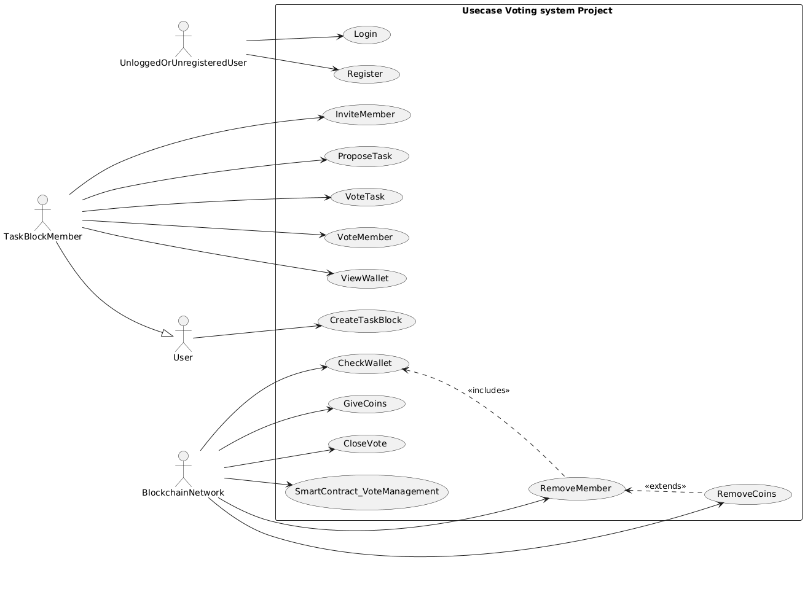

### Class diagram
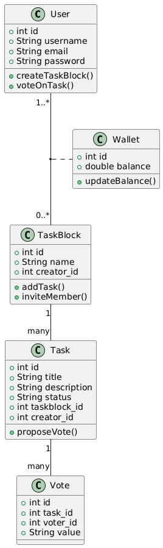
### CentralizedDB schema 
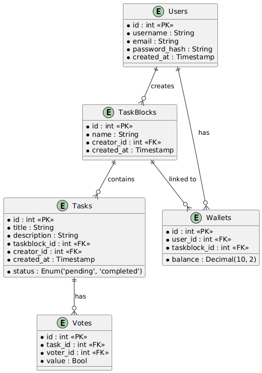


## Preview of the App :
### Home Page
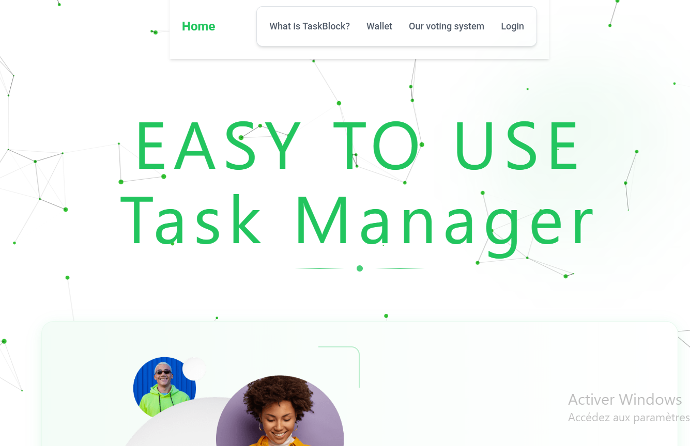
### Login Page
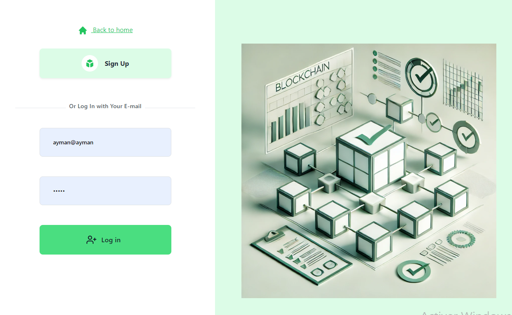
### Sign up Page

### Dashboard Page
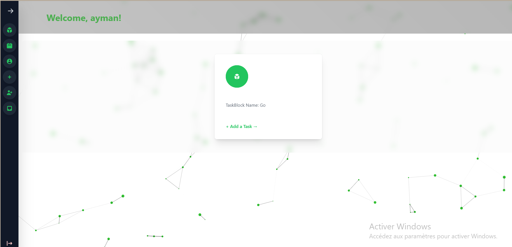
### Create TaskBlock
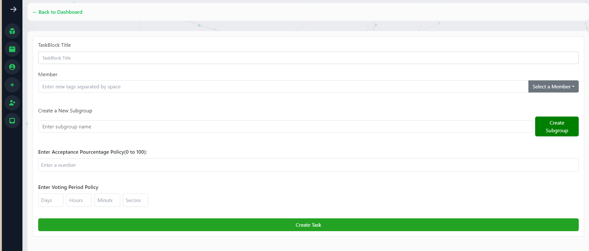
### My Tasks
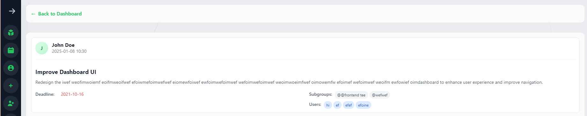
### Invitations 
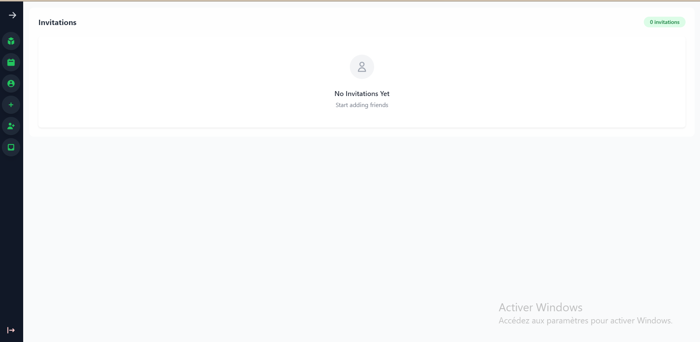
### Search For users
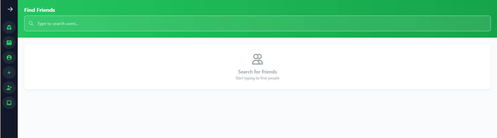
### Show  Friends
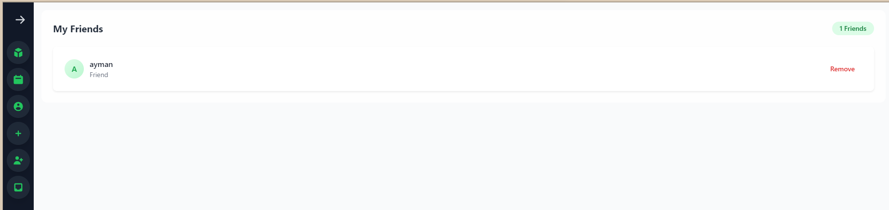
